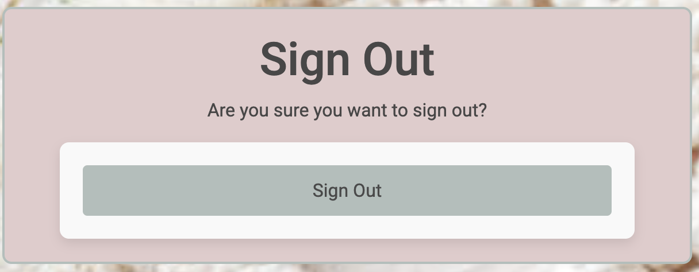
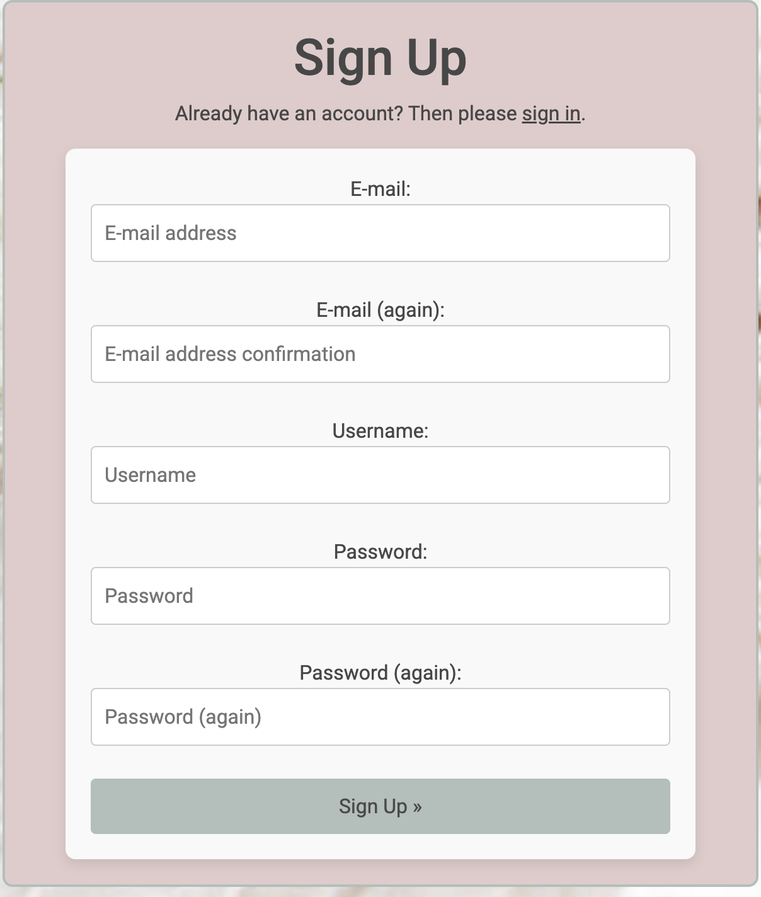
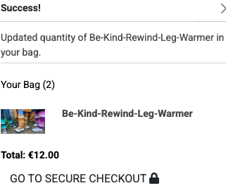

# [Hook It](https://hook-it-85e92c23978c.herokuapp.com/)

Hook It is an online platform that offers a wide range of crochet patterns for enthusiasts of all skill levels. Designed for individuals who love crocheting and are looking for creative patterns to bring their projects to life, the website features a variety of crochet designs, including hats, scarves, shawls, baby booties, blankets, amigurumi, and more.

Users can browse through different patterns, select the ones they like, and easily purchase them. After purchasing, users will be able to download a comprehensive PDF, which includes step-by-step instructions, materials required, and detailed guidance to help them complete their project from start to finish. Whether you're a beginner or an experienced crocheter, Hook It makes it simple to dive into your next crochet creation with clear and accessible patterns.

## App Structure:

The application follows a Business-to-Customer (B2C) model, where products (patterns) are directly sold to customers through the platform. The system is designed to facilitate seamless browsing, purchasing, and downloading of digital patterns, ensuring a smooth user experience.

## UX

### ER diagram:
I have created an Entity-Relationship (ER) diagram that visually represents the relationships between all the data models used in the application. The diagram provides an overview of how the different entities within the system are structured and how they relate to each other.

* The primary entitiesclude User, UserProfile, Category, Pattern, and Review.

* User and UserProfile: The UserProfile model is linked to the User model with a one-to-one relationship, where each user can have only one profile. The profile stores additional information such as the user's default address, phone number, and country.

* Category and Pattern: The Pattern model is related to the Category model via a foreign key, meaning each pattern belongs to a specific category (e.g., 'Beginner', 'Intermediate', 'Advanced'). This relationship allows patterns to be categorized for better organization.

* Pattern and Review: There is a one-to-many relationship between Pattern and Review. Each pattern can have multiple reviews, but each review is associated with only one pattern. The Review model stores feedback from users, including ratings and comments.

* User and Review: The Review model is also linked to the User model, where a user can leave multiple reviews, but each review is written by only one user. This relationship helps track user-generated content and feedback for patterns.

This ER diagram enables a clear understanding of the data structure and how entities within the system are connected, facilitating easier database management and querying. The relationships reflect how the data models are interdependent and how data flows between them to support application functionality.


### Colour Scheme:

For my project, I’ve chosen a well-balanced color scheme that combines subtle tones with a professional, clean look. For the text color, I opted for a slightly darker shade of grey. This choice enhances readability while maintaining a modern and sophisticated feel. The darker grey provides sufficient contrast against the lighter background, ensuring that the content is easy to read without being too harsh or overwhelming, as black text might be. This approach allows for a more refined, comfortable user experience, while also contributing to the overall aesthetic of the design.


### Typography
 
 I have font awesome fonts and icons on my app.

## User Stories:

* User can view explore patterns.
* User can open the pattern and can see pattern detail.
* User can add the pattern to bag using add to bag feature on pattern detail page.
* User can review the pattern on pattern detail page.
* User can Edit and Delete his review.
* User can see if they have anything in the bag by looking at bag icon in the nav bar, if they have patterns in the basket bag will show total amount payable. 
If bag is empty they can see amout 0.00.
* User can open the bag to see what is in the bag.
* User can delete the pattern from the bag.
* User can go checkout securely from the shopping bag page.
* user can return back to pattern page to exple more pattern from shopping bag page.
* User can do a secure checkout using stipe payment form.
* User can see oder detail as well.
* User can acess pattern download link if the payment was successfull.
* User can download the pattern.
* User can contact the administration if they have any problem with patterns using contact us form from the nav bar.
* User can see all his order on his profile, he can see it in the nav bar if he in signed in.
* User can access pattern by clicking order number from profile page. He will access the checkout sucess page from where he can download pattern agin.
* User can Sign up using sign up form.
* User can sign in if thgey have already an account.
* User can logout using logout form.
* User can see his status if he is signbed in or sign out by looking at nav bar. It cahngeds accordingly.
* User can reset the password if they forgot using a button on sign in page.
* User recieves authentication email for secure signup process.

## Admin Stories:

* Admin can access extra feaures form managing the app.
* Admin can add a Pattern using a front end form. he can acess the form from the nav bar named Pattern Management.
* Admin can Edit and delete the pattern as well using edit and delete buttons on pattern and pattern detail page.
* Admin recieves email from the user, if user tryies to contact using contact us form.
* Admin can edit and delete user reviews using frontend as well.


### Site Pages

- **Home page**


The homepage features a clean and minimalist design. At the top, there is a navigation bar that includes the logo on the left-hand side and links and button on the right-hand side for other pages and actions. The central part of the page showcases a prominent slogan, clearly communicating the brand’s message or theme. Below the slogan, there is a call-to-action button inviting users to "Explore the Patterns," encouraging them to engage with the content further. This simple yet effective layout creates a user-friendly experience while keeping the focus on the essential elements of the page.


- **About page**


The About page provides users with an introduction to the platform, explaining who we are and what we offer. It gives a brief overview of crochet, its origins, and its creative potential. The page highlights the various projects and items that can be made using crochet, from decorative pieces to practical accessories, showcasing the versatility and artistry of this craft. This section aims to inspire visitors and give them a deeper understanding of crochet and its endless possibilities.


- **Patterns page**
The Patterns page showcases a variety of crochet patterns, displaying images, names, prices, and ratings for each one. Users can easily explore the available patterns, with each pattern name linked to its detailed page for more information. Additionally, the page offers sorting options, allowing users to filter patterns by name, date, or price, making it easier to find the perfect pattern based on their preferences.


- **Pattern-detail page**

The pattern detail page provides comprehensive information about the pattern, including the materials required and the available sizes that can be made using it. Users who are logged in can rate the pattern and leave reviews. The page displays key details such as the pattern name, difficulty level, price, and a quantity input field. There are also options to add the pattern to the shopping cart or continue shopping. Below the product description, logged-in users can share their feedback by leaving a rating and review of the pattern.


- **contact-us page**

The Contact Us page allows users to reach out to the administration for any issues they may encounter. Messages submitted through the page will be sent to the admin panel as well as the administration's email address.


- **Profile page**


The profile page displays a user's biodata, which can be updated using the provided form. It also includes the user's order history, allowing them to view purchased patterns by clicking on the order number. By selecting an order number, users can revisit the checkout success page and access the download link for their purchased pattern.


- **Pattern management page**


This page is exclusively accessible to the management team, providing a frontend form for adding new patterns. If a user is logged in and is a member of the administration, they will see the Pattern Management option in the navigation bar, allowing them to add new patterns to the Patterns page.


- **Edit pattern page**

This page is also designed for the administration. An Edit button is available on both the Patterns and Pattern Detail pages, allowing admins to easily update pattern information.


- **Shopping Bag page**

This is the Shopping Bag page, where users can view all the patterns they have added to their bag. Each pattern displays five details: Pattern Image, Pattern Name, Price, a Remove button to delete the pattern, and the Subtotal. Users can remove a pattern from the bag using the Remove button. Additionally, they can continue shopping by clicking the Keep Shopping link or proceed to checkout by selecting Secure Checkout.


- **checkout page**

This is the Checkout page, where users can complete their purchase using the Stripe payment system. The page is divided into two sections: the left side contains the payment form, where users enter their details, and the right side displays the order summary, including order details and the total amount. Once the correct information is provided, users can successfully complete their checkout.


- **Checkout Success page**


This is the Checkout Success page, confirming that your order has been completed. A confirmation email with order details has been sent to you. The page displays your order summary along with a download link for your purchased pattern. Additionally, a "Check Out Our Latest Deals!" button is provided, allowing you to return to the patterns page and continue shopping.


- **Order Confirmation Email**

The user will receive a confirmation email containing the details of their order, including the order summary and payment confirmation.


- **Privacy Policy**


This page contains the privacy policy for our app. A link to this page is available in the footer for easy access.


### Allauth Templates:

- **Sign-in page**


- **Sign-out page**


- **Sign-up page**




#### Password Reset Process:

The user can reset their password by providing their email address. A password reset link will be sent to their email, allowing them to securely create a new password.


### User Features

- **Review and Rating**

Users have the opportunity to share their feedback by rating and reviewing the pattern. This allows others to get insights based on real experiences, helping them make more informed decisions before purchasing.


- **pagination**

The patterns page includes a pagination feature, allowing users to easily navigate through multiple pages of patterns without having to scroll endlessly. Users can view a set number of patterns per page and click the "Next Page" button to explore more options. If they wish to go back, they can simply click the "Previous" button to return to the previous page.


- **Sorting**

The pattern page offers a sorting feature that allows users to organize the patterns based on their preferences. Users can sort the patterns by the newest arrivals, price (from highest to lowest or lowest to highest), and alphabetically (from A to Z or Z to A). This makes it easier to find patterns that meet specific criteria.


- **Search**

The search feature allows users to easily find patterns by entering keywords, whether it’s the pattern name, a specific term from the description, or a category. This makes it simple for users to quickly locate the exact pattern they're looking for.


- **Toasts**

Toast notifications are used in the application to provide users with real-time feedback on their actions. These messages appear temporarily at the top-right corner of the screen and automatically fade out after a few seconds.

Toast displays following messages:

* Success messages.

* Error messages.

* Info messages.

* Warning messages.


- **Bag Updates**


When you add a new item in the bag. Bag updates and show you a success message you can see all the items in your bag as well.





- **Newsletter Subscribe**

User can Subscribe for the newsletter using a link provided in the footer of the page.
User need to add his email address and then press the button subscribe.


- **Webhooks**

The site uses a secure and robust webhook system to ensure that the payment process cannot be interrupted and corrupted, either through user error or malicious intent. Webhooks are incorporated via the Stripe payment system and are handled on the Stripe website, by way of the python code in checkout > webhook_handler.py and checkout > webhooks.py.
User is able to recieve order confirmation email using webhook handler.

 


### Future Features:

* User will be able to buy products.
* User will recieve discount codes.
* There will be a blog on the app about the products and patterns.
* User will be able to access Free patterns on the blog posts.


## Agile methodology:

I followed the Agile methodology for planning my project, ensuring an iterative and flexible development process.

To manage tasks efficiently, I created a GitHub repository and set up a custom issue template. This allowed me to streamline the process of creating new issues with a predefined structure, making tracking and managing development tasks more organized and efficient.


I have also created a project within my repository to better organize and track issues. When I create a new issue, I assign it to the project, allowing me to view and manage it within the project's workflow.

To access the project, I navigate to the repository, open the "Projects" tab, and select the relevant project. This helps in maintaining a clear overview of tasks and progress.


Once the project is opened, we can view all the issues along with their current status. I have set up four status columns to track the progress efficiently:

* No Status.
* To Do.
* In progress.
* Done

We can easily drag and drop issues into the appropriate columns based on their current status. Additionally, I have assigned custom labels to categorize issues, such as "Important," "Completed," and "Future Feature" for better organization and tracking.


You can find project link here [Project](https://github.com/users/raheelaahmed/projects/7/views/3)


## Search Engine Optimization (SEO) & Social Media Marketing:

I have optimized my website for search engines by verifying it with Google Search Console, using Google verification meta tags.

As my app is for crochet pattern so i made sure to use keywords in my tag line and on about page and in pattern detail.


### Social media:

Building a strong social media presence and linking it to the business website can help drive sales. Using popular platforms with a large user base, such as Facebook, can significantly increase site traffic. I have created a Facebook page for the app, and the link is available in the footer of the website.


### Sitemap

I've used [XML-Sitemaps](https://www.xml-sitemaps.com) to generate a sitemap.xml file.
This was generated using my deployed site URL: https://hook-it-85e92c23978c.herokuapp.com/

After it finished crawling the entire site, it created a
[sitemap.xml](sitemap.xml) which I've downloaded and included in the repository.

### Robots

I've created the [robots.txt](robots.txt) file at the root-level.
Inside, I've included the default settings:

```
User-agent: *
Disallow:
Sitemap: https://hook-it-85e92c23978c.herokuapp.com//sitemap.xml
```

Further links for future implementation:
- [Google search console](https://search.google.com/search-console)
- [Creating and submitting a sitemap](https://developers.google.com/search/docs/advanced/sitemaps/build-sitemap)
- [Managing your sitemaps and using sitemaps reports](https://support.google.com/webmasters/answer/7451001)
- [Testing the robots.txt file](https://support.google.com/webmasters/answer/6062598)


## Tools & Technologies Used
* HTML used for the main site content.
* CSS used for the main site design and layout.
* JavaScript used for user interaction on the site.
* Python used as the back-end programming language.
* Git used for version control. (git add, git commit, git push)
* GitHub used for secure online code storage.
* Gitpod used as a cloud-based IDE for development.
* Bootstrap used as the front-end CSS framework for modern responsiveness and pre-built components.
* Django used as the Python framework for the site.
* PostgreSQL used as the relational database management.
* ElephantSQL used as the Postgres database.
* Psycopg2 used as a PostgreSQL database adapter
* Heroku used for hosting the deployed back-end site.
* Stripe used for online secure payments of ecommerce products/services.
* AWS S3 used for online static file storage.
* Allauth used as the user authentication system
* Pillow used as the Python framework for the site.
* Gunicorn used for WSGI server
* Crispy Forms used for auto-formatting of front-end forms
* django_ckeditor_5 used for styling text.

## Testing:
[Testing](TESTING.md)

#### Cloning:

## Deployment

The live deployed application can be found deployed on Heroku.

[Live App](https://hook-it-85e92c23978c.herokuapp.com/)

## ElephantSQL Database

This project uses ElephantSQL for the PostgreSQL Database.

To obtain your own Postgres Database.

* proveide your email at  [PostgreSQL-from-Code-Institute](https://dbs.ci-dbs.net/).

* You will recive your database URL in the email you have provided in the above link.

* add this url in env.py file.

* add Data base url in your setting.py file.


### Amazon AWS

This project uses [AWS](https://aws.amazon.com) to store media and static files online, due to the fact that Heroku doesn't persist this type of data.

Once you've created an AWS account and logged-in, follow these series of steps to get your project connected.
Make sure you're on the **AWS Management Console** page.

#### S3 Bucket

- Search for **S3**.
- Create a new bucket, give it a name (matching your Heroku app name), and choose the region closest to you.
- Uncheck **Block all public access**, and acknowledge that the bucket will be public (required for it to work on Heroku).
- From **Object Ownership**, make sure to have **ACLs enabled**, and **Bucket owner preferred** selected.
- From the **Properties** tab, turn on static website hosting, and type `index.html` in their respective fields, then click **Save**.
- From the **Permissions** tab, paste in the following CORS configuration:

	```shell
	[
		{
			"AllowedHeaders": [
				"Authorization"
			],
			"AllowedMethods": [
				"GET"
			],
			"AllowedOrigins": [
				"*"
			],
			"ExposeHeaders": []
		}
	]
	```

- Copy your **ARN** string.
- From the **Bucket Policy** tab, select the **Policy Generator** link, and use the following steps:
	- Policy Type: **S3 Bucket Policy**
	- Effect: **Allow**
	- Principal: `*`
	- Actions: **GetObject**
	- Amazon Resource Name (ARN): **paste-your-ARN-here**
	- Click **Add Statement**
	- Click **Generate Policy**
	- Copy the entire Policy, and paste it into the **Bucket Policy Editor**

		```shell
		{
			"Id": "Policy1234567890",
			"Version": "2012-10-17",
			"Statement": [
				{
					"Sid": "Stmt1234567890",
					"Action": [
						"s3:GetObject"
					],
					"Effect": "Allow",
					"Resource": "arn:aws:s3:::your-bucket-name/*"
					"Principal": "*",
				}
			]
		}
		```

	- Before you click "Save", add `/*` to the end of the Resource key in the Bucket Policy Editor (like above).
	- Click **Save**.
- From the **Access Control List (ACL)** section, click "Edit" and enable **List** for **Everyone (public access)**, and accept the warning box.
	- If the edit button is disabled, you need to change the **Object Ownership** section above to **ACLs enabled** (mentioned above).

#### IAM

Back on the AWS Services Menu, search for and open **IAM** (Identity and Access Management).
Once on the IAM page, follow these steps:

- From **User Groups**, click **Create New Group**.
	- group + the project name
- Tags are optional, but you must click it to get to the **review policy** page.
- From **User Groups**, select your newly created group, and go to the **Permissions** tab.
- Open the **Add Permissions** dropdown, and click **Attach Policies**.
- Select the policy, then click **Add Permissions** at the bottom when finished.
- From the **JSON** tab, select the **Import Managed Policy** link.
	- Search for **S3**, select the `AmazonS3FullAccess` policy, and then **Import**.
	- You'll need your ARN from the S3 Bucket copied again, which is pasted into "Resources" key on the Policy.

		```shell
		{
			"Version": "2012-10-17",
			"Statement": [
				{
					"Effect": "Allow",
					"Action": "s3:*",
					"Resource": [
						"arn:aws:s3:::your-bucket-name",
						"arn:aws:s3:::your-bucket-name/*"
					]
				}
			]
		}
		```
	
	- Click **Review Policy**.
	-  policy + the project name
	- Provide a description:
		- "Access to S3 Bucket for web-piano-academy static files."
	- Click **Create Policy**.
- From **User Groups**, click your "group-web-piano-academy".
- Click **Attach Policy**.
- Search for the policy you've just created ("policy-web-piano-academy") and select it, then **Attach Policy**.
- From **User Groups**, click **Add User**.
	- user + the project name
- For "Select AWS Access Type", select **Programmatic Access**.
- Select the group to add your new user to group.
- Tags are optional, but you must click it to get to the **review user** page.
- Click **Create User** once done.
- You should see a button to **Download .csv**, so click it to save a copy on your system.
	- **IMPORTANT**: once you pass this page, you cannot come back to download it again, so do it immediately!
	- This contains the user's **Access key ID** and **Secret access key**.
	- `AWS_ACCESS_KEY_ID` = **Access key ID**
	- `AWS_SECRET_ACCESS_KEY` = **Secret access key**

#### Final AWS Setup

- If Heroku Config Vars has `DISABLE_COLLECTSTATIC` still, this can be removed now, so that AWS will handle the static files.
- Back within **S3**, create a new folder called: `media` and `media/files`.
- Select any existing media images for your project to prepare them for being uploaded into the new folder.
- Under **Manage Public Permissions**, select **Grant public read access to this object(s)**.
- No further settings are required, so click **Upload**.

### Stripe API

This project uses [Stripe](https://stripe.com) to handle the ecommerce payments.

Once you've created a Stripe account and logged-in, follow these series of steps to get your project connected.

- From your Stripe dashboard, click to expand the "Get your test API keys".
- You'll have two keys here:
	- `STRIPE_PUBLIC_KEY` = Publishable Key (starts with **pk**)
	- `STRIPE_SECRET_KEY` = Secret Key (starts with **sk**)

As a backup, in case users prematurely close the purchase-order page during payment, we can include Stripe Webhooks.

- From your Stripe dashboard, click **Developers**, and select **Webhooks**.
- From there, click **Add Endpoint**.
	- `https://hook-it-85e92c23978c.herokuapp.com/checkout/wh/`
- Click **receive all events**.
- Click **Add Endpoint** to complete the process.
- You'll have a new key here:
	- `STRIPE_WH_SECRET` = Signing Secret (Wehbook) Key (starts with **wh**)

### Gmail API

This project uses [Gmail](https://mail.google.com) to handle sending emails to users for account verification and purchase order confirmations.

Once you've created a Gmail (Google) account and logged-in, follow these series of steps to get your project connected.

- Click on the **Account Settings** (cog icon) in the top-right corner of Gmail.
- Click on the **Accounts and Import** tab.
- Within the section called "Change account settings", click on the link for **Other Google Account settings**.
- From this new page, select **Security** on the left.
- Select **2-Step Verification** to turn it on. (verify your password and account)
- Once verified, select **Turn On** for 2FA.
- Navigate back to the **Security** page, and you'll see a new option called **App passwords**.
- This might prompt you once again to confirm your password and account.
- Select **Mail** for the app type.
- Select **Other (Custom name)** for the device type.
	- Any custom name, such as "Django" or web-piano-academy
- You'll be provided with a 16-character password (API key).
	- Save this somewhere locally, as you cannot access this key again later!
	- `EMAIL_HOST_PASS` = user's 16-character API key
	- `EMAIL_HOST_USER` = user's own personal Gmail email address

### Heroku Deployment

This project uses [Heroku](https://www.heroku.com), a platform as a service (PaaS) that enables developers to build, run, and operate applications entirely in the cloud.

Deployment steps are as follows, after account setup:

- Select **New** in the top-right corner of your Heroku Dashboard, and select **Create new app** from the dropdown menu.
- Your app name must be unique, and then choose a region closest to you (EU or USA), and finally, select **Create App**.
- From the new app **Settings**, click **Reveal Config Vars**, and set your environment variables.

| Key | Value |
| --- | --- |
| `AWS_ACCESS_KEY_ID` | user's own value |
| `AWS_SECRET_ACCESS_KEY` | user's own value |
| `DATABASE_URL` | user's own value |
| `DISABLE_COLLECTSTATIC` | 1 (*this is temporary, and can be removed for the final deployment*) |
| `EMAIL_HOST_PASS` | user's own value |
| `EMAIL_HOST_USER` | user's own value |
| `SECRET_KEY` | user's own value |
| `STRIPE_PUBLIC_KEY` | user's own value |
| `STRIPE_SECRET_KEY` | user's own value |
| `STRIPE_WH_SECRET` | user's own value |
| `USE_AWS` | True |

Heroku needs two additional files in order to deploy properly.

- requirements.txt
- Procfile

You can install this project's **requirements** (where applicable) using:

- `pip3 install -r requirements.txt`

If you have your own packages that have been installed, then the requirements file needs updated using:

- `pip3 freeze --local > requirements.txt`

The **Procfile** can be created with the following command:

- `echo web: gunicorn app_name.wsgi > Procfile`
- *replace **app_name** with the name of your primary Django app name; the folder where settings.py is located*

For Heroku deployment, follow these steps to connect your own GitHub repository to the newly created app:

Either:

- Select **Automatic Deployment** from the Heroku app.

Or:

- In the Terminal/CLI, connect to Heroku using this command: `heroku login -i`
- Set the remote for Heroku: `heroku git:remote -a app_name` (replace *app_name* with your app name)
- After performing the standard Git `add`, `commit`, and `push` to GitHub, you can now type:
	- `git push heroku main`

The project should now be connected and deployed to Heroku!

### Local Deployment

This project can be cloned or forked in order to make a local copy on your own system.

For either method, you will need to install any applicable packages found within the *requirements.txt* file.

- `pip3 install -r requirements.txt`.

You will need to create a new file called `env.py` at the root-level,
and include the same environment variables listed above from the Heroku deployment steps.

Sample `env.py` file:

```python
import os

os.environ.setdefault("AWS_ACCESS_KEY_ID", "user's own value")
os.environ.setdefault("AWS_SECRET_ACCESS_KEY", "user's own value")
os.environ.setdefault("DATABASE_URL", "user's own value")
os.environ.setdefault("EMAIL_HOST_PASS", "user's own value")
os.environ.setdefault("EMAIL_HOST_USER", "user's own value")
os.environ.setdefault("SECRET_KEY", "user's own value")
os.environ.setdefault("STRIPE_PUBLIC_KEY", "user's own value")
os.environ.setdefault("STRIPE_SECRET_KEY", "user's own value")
os.environ.setdefault("STRIPE_WH_SECRET", "user's own value")

# local environment only (do not include these in production/deployment!)
os.environ.setdefault("DEBUG", "True")
```

Once the project is cloned or forked, in order to run it locally, you'll need to follow these steps:

- Start the Django app: `python3 manage.py runserver`
- Stop the app once it's loaded: `CTRL+C` or `⌘+C` (Mac)
- Make any necessary migrations: `python3 manage.py makemigrations`
- Migrate the data to the database: `python3 manage.py migrate`
- Create a superuser: `python3 manage.py createsuperuser`
- Load fixtures (if applicable): `python3 manage.py loaddata file-name.json` (repeat for each file)
- Everything should be ready now, so run the Django app again: `python3 manage.py runserver`

If you'd like to backup your database models, use the following command for each model you'd like to create a fixture for:

- `python3 manage.py dumpdata your-model > your-model.json`
- *repeat this action for each model you wish to backup*

#### Cloning

You can clone the repository by following these steps:

1. Go to the [GitHub repository](https://github.com/raheelaahmed/hook-it) 
2. Locate the Code button above the list of files and click it 
3. Select if you prefer to clone using HTTPS, SSH, or GitHub CLI and click the copy button to copy the URL to your clipboard
4. Open Git Bash or Terminal
5. Change the current working directory to the one where you want the cloned directory
6. In your IDE Terminal, type the following command to clone my repository:
	- `git clone https://github.com/raheelaahmed/hook-it.git`
7. Press Enter to create your local clone.


#### Forking

By forking the GitHub Repository, we make a copy of the original repository on our GitHub account to view and/or make changes without affecting the original owner's repository.
You can fork this repository by using the following steps:

1. Log in to GitHub and locate the [GitHub Repository](https://github.com/raheelaahmed/hook-it)
2. At the top of the Repository (not top of page) just above the "Settings" Button on the menu, locate the "Fork" Button.
3. Once clicked, you should now have a copy of the original repository in your own GitHub account!


### Media:
| Resource | Description |
|----------|-------------|
| [Creative Crochet Corner](https://go.creativecrochetcorner.com/) | Used pattern images and files. |
| [Unsplash](https://unsplash.com/) | Used images from Unsplash. |
| Google Images | Used images from Google Images. |
| [Flaticon](https://www.flaticon.com) | Used logo from Flaticon. |

### Acknowledgements


- I would like to thank my Family, for believing in me, and helping me to make this transition into software development.
- I would like to thank my Code Institute mentor `cans` for their support throughout the development of this project.
- I would like to thank the [Code Institute](https://codeinstitute.net) tutor team for their assistance with troubleshooting and debugging some project issues.
- I would like to thank the [Code Institute Slack community](https://code-institute-room.slack.com) for the moral support; it kept me going during periods of self doubt and imposter syndrome.


## Credits

| Resource | Description |
|----------|-------------|
| [Coolors](https://coolors.co/) | A tool for creating color schemes. |
| [Pagination Tutorial](https://www.youtube.com/watch?v=wY_BNsxCEi4) | I followed this video for adding pagination. |
| [Footer Position Tutorial](https://www.youtube.com/watch?v=J-r75L3Tflg) | I followed this video for keeping the footer at the bottom of the page without using fixed or sticky position. |
| [DB Diagram](https://dbdiagram.io/) | Used for creating an ER diagram. |
| [Mailchimp](https://mailchimp.com/?currency=EUR) | Platform used for email marketing and automation. |
| [Boutique Ado](https://github.com/Code-Institute-Solutions/boutique_ado_v1) | entire site | Various code sections taken from the CI Boutique Ado Walkthrough Project |


### Content:

I have used content from https://go.creativecrochetcorner.com/.


# bugs and fixes:

foreign key error in serch term


solution:

Since category is a foreign key, we can't filter it with icontains directly as if it were a CharField. we need to filter based on a field within the related Category model, like category__name__icontains.


## Error redirect error:

Redirect error for clicking add to bag button.


Solution:

Import Redirect from django shortcuts.

## Cispy_form error:

Crispy_form error :


Solution:

added 'crispy_bootstrap4' in installed apps to fix it.


## stripe card input field disabled:

Issue: On the checkout page, the payment card input field was disabled due to an insecure form connection.

Solution: I resolved this issue by clearing the browser history and cache, which allowed the form to reload securely.


## problem with media files:

Issue: I was unable to view media files, such as the logo, background, and other images, on my app.


Solution: After removing the SSL configuration from the settings, everything started working properly.


