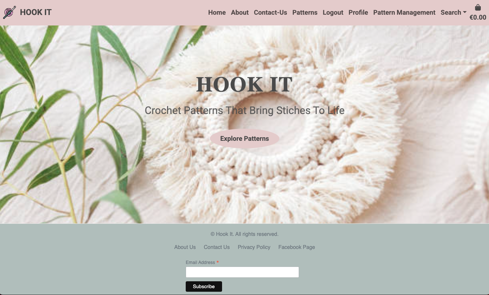
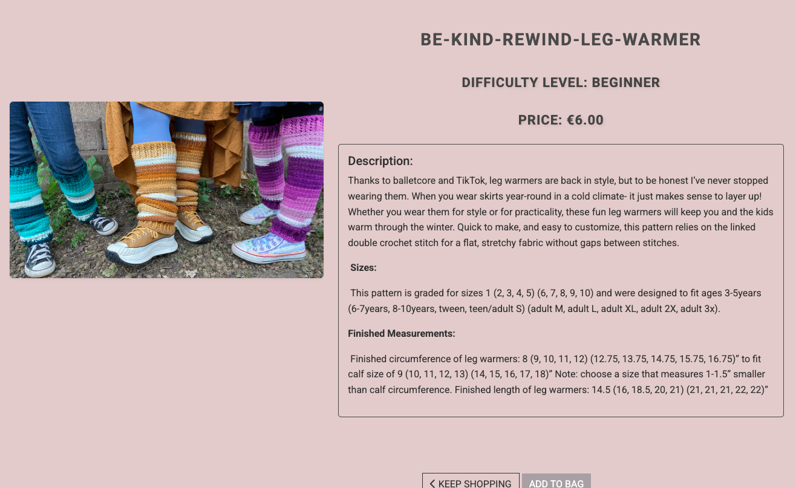
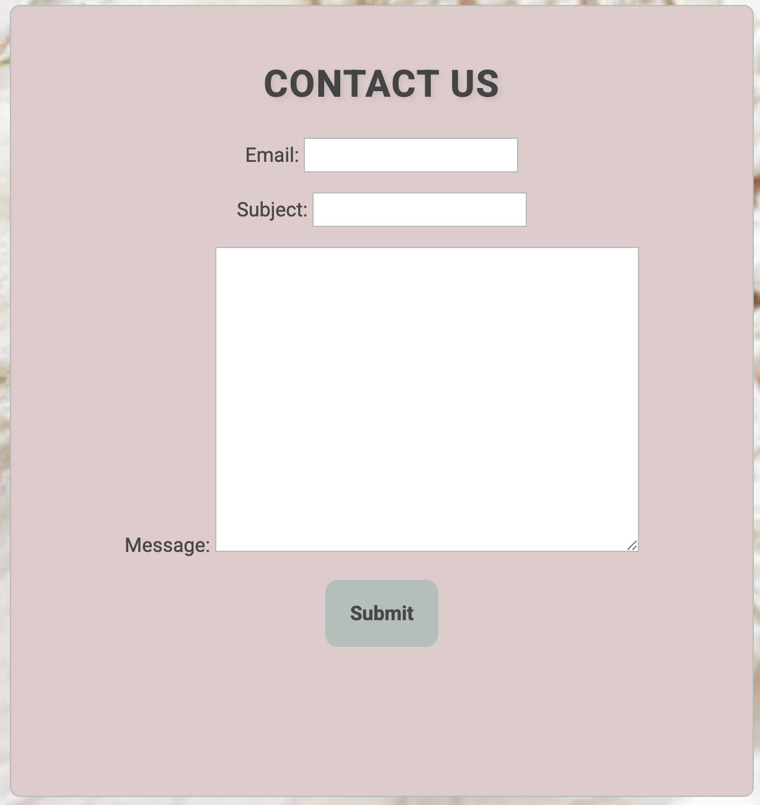
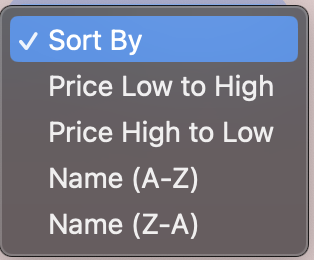

# [Hook It](https://hook-it-85e92c23978c.herokuapp.com/)

Hook It is an online platform that offers a wide range of crochet patterns for enthusiasts of all skill levels. Designed for individuals who love crocheting and are looking for creative patterns to bring their projects to life, the website features a variety of crochet designs, including hats, scarves, shawls, baby booties, blankets, amigurumi, and more.

Users can browse through different patterns, select the ones they like, and easily purchase them. After purchasing, users will be able to download a comprehensive PDF, which includes step-by-step instructions, materials required, and detailed guidance to help them complete their project from start to finish. Whether you're a beginner or an experienced crocheter, Hook It makes it simple to dive into your next crochet creation with clear and accessible patterns.
## UX

### ER diagram:
I have created an Entity-Relationship (ER) diagram that visually represents the relationships between all the data models used in the application. The diagram provides an overview of how the different entities within the system are structured and how they relate to each other.

* The primary entitiesclude User, UserProfile, Category, Pattern, and Review.

* User and UserProfile: The UserProfile model is linked to the User model with a one-to-one relationship, where each user can have only one profile. The profile stores additional information such as the user's default address, phone number, and country.

* Category and Pattern: The Pattern model is related to the Category model via a foreign key, meaning each pattern belongs to a specific category (e.g., 'Beginner', 'Intermediate', 'Advanced'). This relationship allows patterns to be categorized for better organization.

* Pattern and Review: There is a one-to-many relationship between Pattern and Review. Each pattern can have multiple reviews, but each review is associated with only one pattern. The Review model stores feedback from users, including ratings and comments.

* User and Review: The Review model is also linked to the User model, where a user can leave multiple reviews, but each review is written by only one user. This relationship helps track user-generated content and feedback for patterns.

This ER diagram enables a clear understanding of the data structure and how entities within the system are connected, facilitating easier database management and querying. The relationships reflect how the data models are interdependent and how data flows between them to support application functionality.

### Colour Scheme:

For my project, I’ve chosen a well-balanced color scheme that combines subtle tones with a professional, clean look. For the text color, I opted for a slightly darker shade of grey. This choice enhances readability while maintaining a modern and sophisticated feel. The darker grey provides sufficient contrast against the lighter background, ensuring that the content is easy to read without being too harsh or overwhelming, as black text might be. This approach allows for a more refined, comfortable user experience, while also contributing to the overall aesthetic of the design.

### Typography
## User Stories
## Features

### Existing Features

### Site Pages

- **Home page**

The homepage features a clean and minimalist design. At the top, there is a navigation bar that includes the logo on the left-hand side and links and button on the right-hand side for other pages and actions. The central part of the page showcases a prominent slogan, clearly communicating the brand’s message or theme. Below the slogan, there is a call-to-action button inviting users to "Explore the Patterns," encouraging them to engage with the content further. This simple yet effective layout creates a user-friendly experience while keeping the focus on the essential elements of the page.

- **About page**

The About page provides users with an introduction to the platform, explaining who we are and what we offer. It gives a brief overview of crochet, its origins, and its creative potential. The page highlights the various projects and items that can be made using crochet, from decorative pieces to practical accessories, showcasing the versatility and artistry of this craft. This section aims to inspire visitors and give them a deeper understanding of crochet and its endless possibilities.

- **Patterns page**
The Patterns page showcases a variety of crochet patterns, displaying images, names, prices, and ratings for each one. Users can easily explore the available patterns, with each pattern name linked to its detailed page for more information. Additionally, the page offers sorting options, allowing users to filter patterns by name, date, or price, making it easier to find the perfect pattern based on their preferences.

- **Pattern-detail page**

The pattern detail page provides comprehensive information about the pattern, including the materials required and the available sizes that can be made using it. Users who are logged in can rate the pattern and leave reviews. The page displays key details such as the pattern name, difficulty level, price, and a quantity input field. There are also options to add the pattern to the shopping cart or continue shopping. Below the product description, logged-in users can share their feedback by leaving a rating and review of the pattern.

- **contact-us page**

The Contact Us page allows users to reach out to the administration for any issues they may encounter. Messages submitted through the page will be sent to the admin panel as well as the administration's email address.

- **Profile page**

The profile page displays a user's biodata, which can be updated using the provided form. It also includes the user's order history, allowing them to view purchased patterns by clicking on the order number. By selecting an order number, users can revisit the checkout success page and access the download link for their purchased pattern.

- **Pattern management page**

This page is exclusively accessible to the management team, providing a frontend form for adding new patterns. If a user is logged in and is a member of the administration, they will see the Pattern Management option in the navigation bar, allowing them to add new patterns to the Patterns page.

- **Edit pattern page**

This page is also designed for the administration. An Edit button is available on both the Patterns and Pattern Detail pages, allowing admins to easily update pattern information.

- **Shopping Bag page**

This is the Shopping Bag page, where users can view all the patterns they have added to their bag. Each pattern displays five details: Pattern Image, Pattern Name, Price, a Remove button to delete the pattern, and the Subtotal. Users can remove a pattern from the bag using the Remove button. Additionally, they can continue shopping by clicking the Keep Shopping link or proceed to checkout by selecting Secure Checkout.

### User Features

- **Review and Rating**

Users have the opportunity to share their feedback by rating and reviewing the pattern. This allows others to get insights based on real experiences, helping them make more informed decisions before purchasing.

- **pagination**

The patterns page includes a pagination feature, allowing users to easily navigate through multiple pages of patterns without having to scroll endlessly. Users can view a set number of patterns per page and click the "Next Page" button to explore more options. If they wish to go back, they can simply click the "Previous" button to return to the previous page.

- **Sorting**

The pattern page offers a sorting feature that allows users to organize the patterns based on their preferences. Users can sort the patterns by the newest arrivals, price (from highest to lowest or lowest to highest), and alphabetically (from A to Z or Z to A). This makes it easier to find patterns that meet specific criteria.

- **Search**

The search feature allows users to easily find patterns by entering keywords, whether it’s the pattern name, a specific term from the description, or a category. This makes it simple for users to quickly locate the exact pattern they're looking for.

- **Toasts**

- **Basket Updates**

- **User Email Confirmations**

- **Course Sort**

- **Course Search**

- **Newsletter Subscribe**

- **Newsletter Unsubscribe**

### Admin Features

- **Webhooks**

### Future Features

## Testing

#### Cloning

## Credits

* https://www.flaticon.com   (logo)
* https://coolors.co/
* https://www.youtube.com/watch?v=wY_BNsxCEi4
i have followed this video for adding pagination.
* https://www.youtube.com/watch?v=J-r75L3Tflg
i have followed this video for kepping the footer at the botom of page without using fixed or stickey position.
* https://dbdiagram.io/ .
* https://mailchimp.com/?currency=EUR
created ER diagram
### Content

### Media

# bugs and fixes:

foreign key error in serch term

solution:

Since category is a foreign key, we can't filter it with icontains directly as if it were a CharField. we need to filter based on a field within the related Category model, like category__name__icontains.

## Error redirect error:

Redirect error for clicking add to bag button.

Solution:

Import Redirect from django shortcuts.

## Cispy_form error:

Crispy_form error :

Solution:

added 'crispy_bootstrap4' in installed apps to fix it.

## stripe card input field disabled:

Issue: On the checkout page, the payment card input field was disabled due to an insecure form connection.

Solution: I resolved this issue by clearing the browser history and cache, which allowed the form to reload securely.

## problem with media files:

Issue: I was unable to view media files, such as the logo, background, and other images, on my app.

Solution: After removing the SSL configuration from the settings, everything started working properly.

