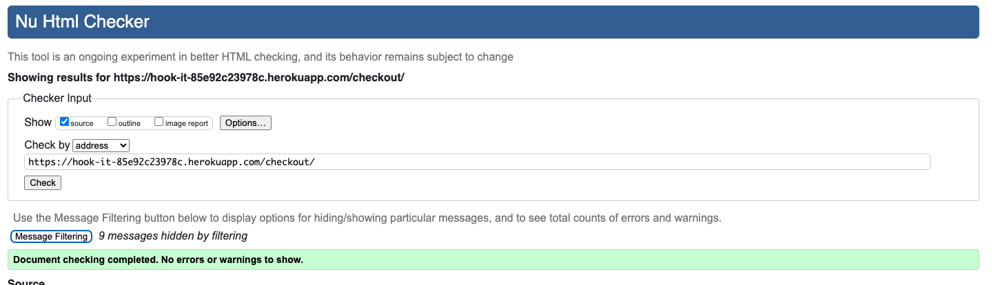
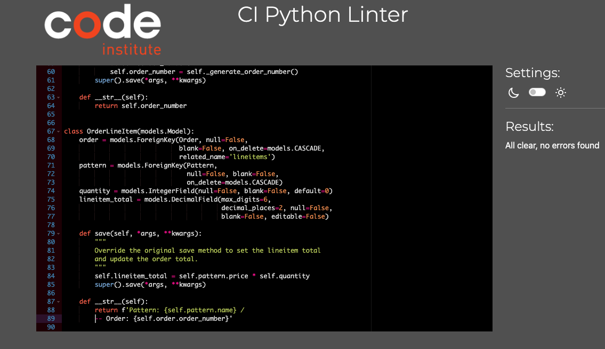
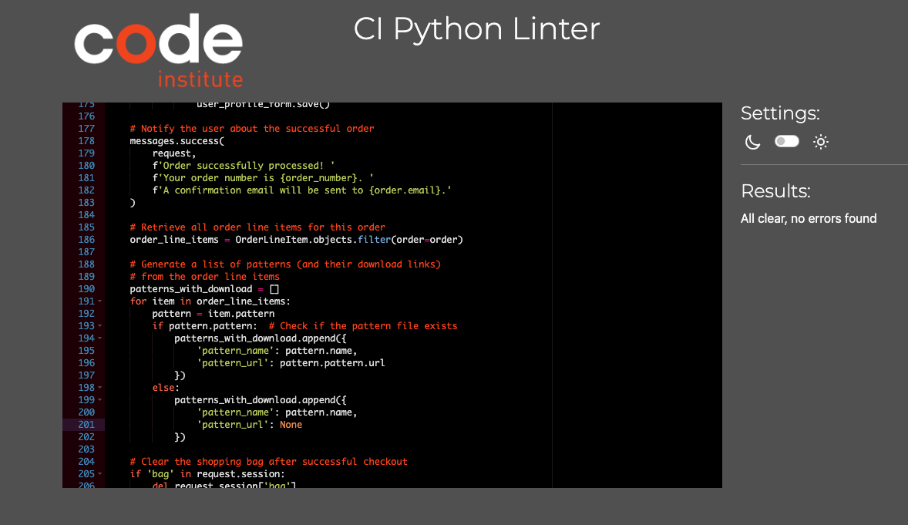
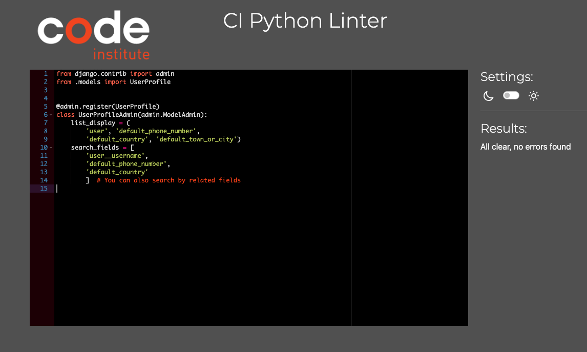
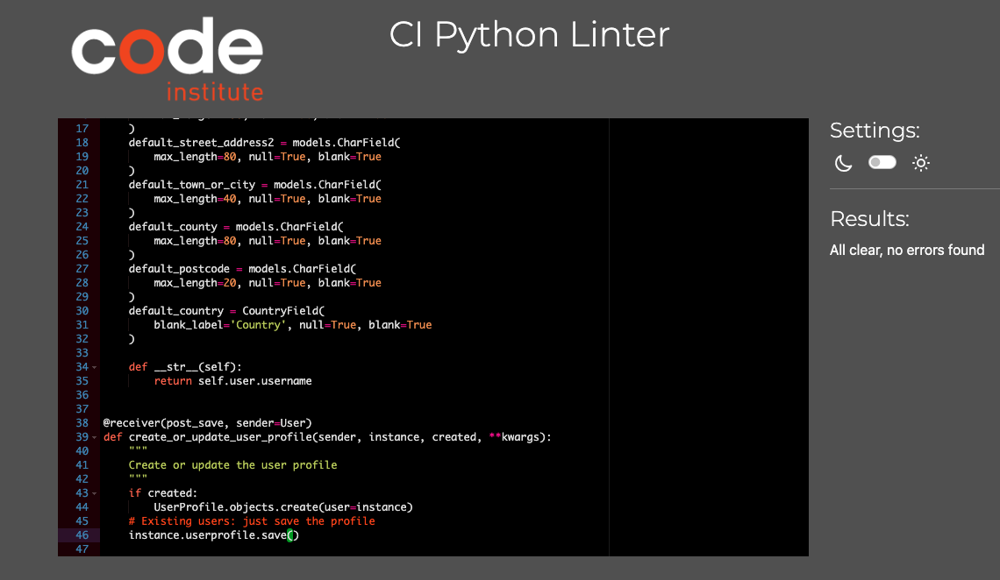
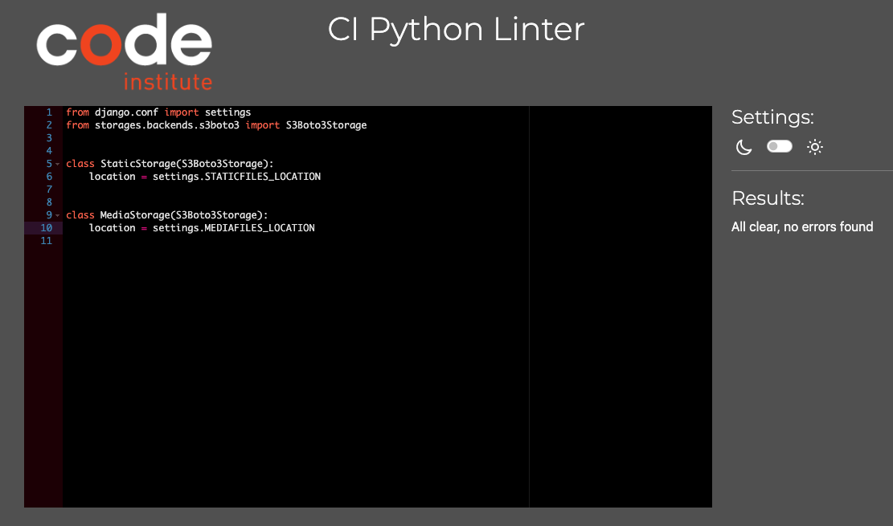
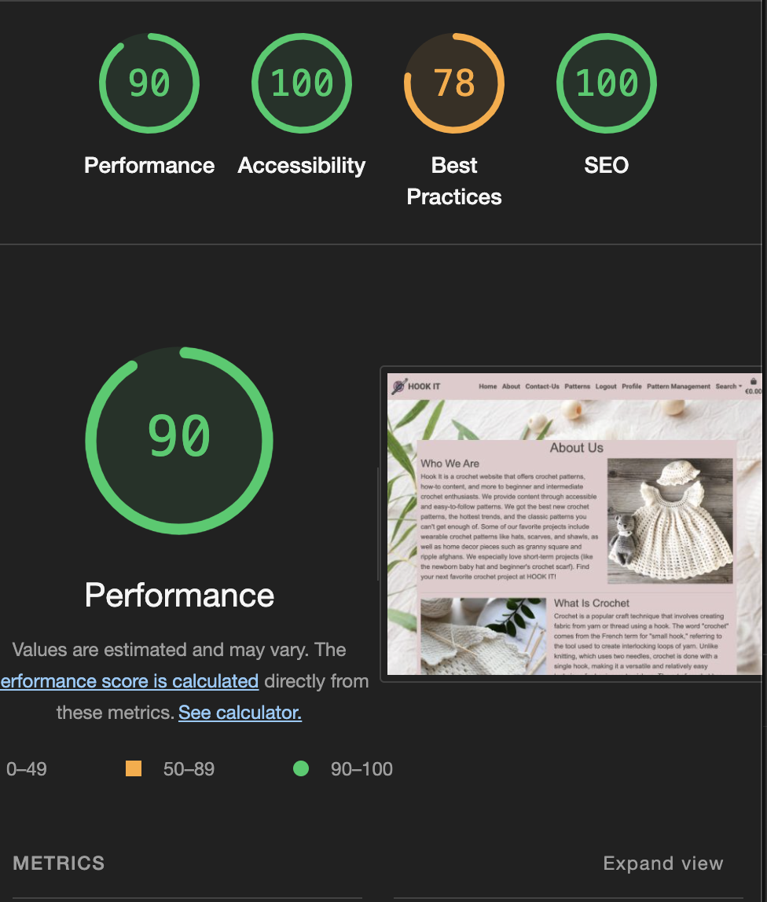
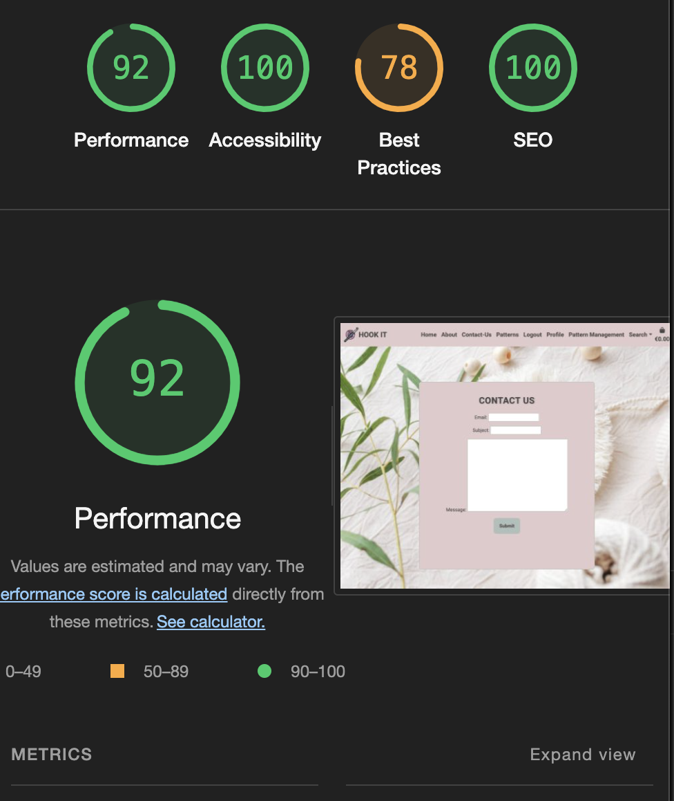
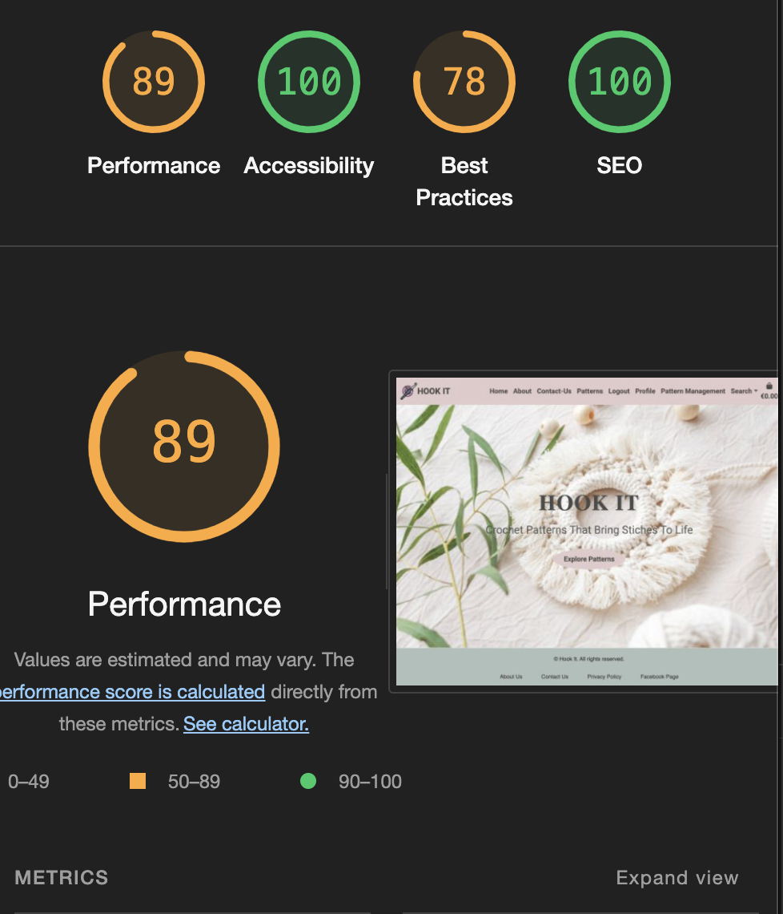
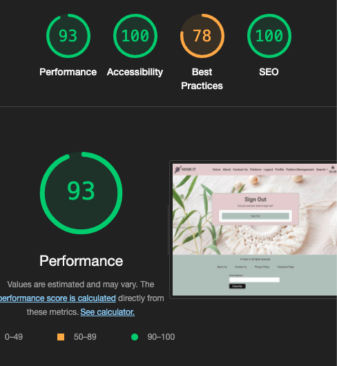

# Testing

Return back to the [README.md](README.md) file.

## Code Validation

### HTML

I have used the recommended [HTML W3C Validator](https://validator.w3.org) to validate all of my HTML files.

| Page | W3C URL | Screenshot | Notes |
| --- | --- | --- | --- |
| 404 | | Pass: No Errors |
| about |  | Pass: No Errors |
| add-pattern |   | Pass: No Errors |
| bag |  | Pass: No Errors |
| checkout |   | Pass: No Errors |
| checkout-success |   | Pass: No Errors |
| contact |   | Pass: No Errors |
| patterns |  | Pass: No Errors |
| edit-pattern |  | Pass: No Errors |
| delete-confirm |  | Pass: No Errors |
| home |   | Pass: No Errors |
| login |   | Pass: No Errors |
| pattern-detail |   | Pass: No Errors |
| profile | | Pass: No Errors |
| register |   | Pass: No Errors |
| sign-out |   | Pass: No Errors |

### CSS

I have used the recommended [CSS Jigsaw Validator](https://jigsaw.w3.org/css-validator) to validate all of my CSS files.

| File | Screenshot | Notes |
| --- | --- | --- |
| base.css |  | Pass: No Errors( input base.css code passed but there are errors from external css fields given below) |
| external css |  | Fail: external css files like bootstrap,chimpmonk mail causing errors|
| checkout.css |  | Pass: No Errors |
| profile.css |   | Pass: No Errors |

### JavaScript

I have used the recommended [JShint Validator](https://jshint.com) to validate all of my JS files.

| File | Screenshot | Notes |
| --- | --- | --- |
| stripe_elements.js |  | warning (use version 6)|
| countryfield.js |  | Pass: No Errors |
| quantity-input-script.js |  | warning (use version 6) |

### Python

I have used the recommended [PEP8 CI Python Linter](https://pep8ci.herokuapp.com) to validate all of my Python files.

### Bag App
| File |  Screenshot | Notes |
| --- | --- | --- |
| apps.py |  | Pass: No Errors |
| contexts.py |  | Pass: No Errors |
| urls.py | | Pass: No Errors |
| views.py |   | E501(line too long)|

### Checkout App
| File | CI URL | Screenshot | Notes |
| --- | --- | --- | --- |
| admin.py |  | Pass: No Errors |
| apps.py |  | Pass: No Errors |
| forms.py |  | line too long |
| models.py |  | line too long, no newline at the end.|
| signals.py |  | no new line |
| urls.py | | line too long |
| views.py | | Pline too long |
| webhook_handler.py | | line too long, no new line |
| webhooks.py |   | line too long |

### Hook_It App
| File | CI URL | Screenshot | Notes |
| --- | --- | --- | --- |
| asgi.py |  | Pass: No Errors |
| settings.py |   | line too long |
| urls.py |   | line too long |
| views.py |   | Pass: No Errors |
| wsgi.py |  | Pass: No Errors |

### Contact App
| File | CI URL | Screenshot | Notes |
| --- | --- | --- | --- |
| admin.py |   | line too long |
| apps.py |  | Pass: No Errors |
| models.py |  | Pass: No Errors |
| urls.py |   | Pass: No Errors |
| views.py |  | line too long |

### Home App
| File |  Screenshot | Notes |
| --- |  --- | --- |
| apps.py | | Pass: No Errors |
| urls.py |   | Pass: No Errors |
| views.py |   | line too long |

### Patterns App
| File |  Screenshot | Notes |
| --- | --- | --- |
| admin.py |  |line too long |
| apps.py |  | Pass: No Errors |
| forms.py |   | line too long |
| models.py |   | Pass: No Errors |
| urls.py |   | Pass: No Errors |
| views.py |   | line too long|

### Profiles App
| File |  Screenshot | Notes |
| --- | --- | --- |
| admin.py |   | Pass: No Errors |
| apps.py |   | line too long |
| forms.py |  | line too long|
| models.py |   | line too long |
| urls.py |   | line too long|
| views.py |   | line too long |

### Root Level Files
| File | Screenshot | Notes |
| --- | --- | --- |
| custom_storages.py |  | Pass: No Errors |
| manage.py |  | Pass: No Errors |

## Browser Compatibility

I've tested my deployed project on multiple browsers to check for compatibility issues.

| Browser | Screenshot | Notes |
| --- | --- | --- |
| Chrome |  | Works as expected |
| Safari |  | Works as expected |

## Responsiveness

I've tested my deployed project on multiple devices to check for responsiveness issues.

| Device | Screenshot | Notes |
| --- | --- | --- |
| Mobile (googl3-pixel-7) |  | Works as expected |
| Tablet (ipad-air) |  | Works as expected |
| Mac-book |  | Works as expected |
| XL Monitor |  | Works as expected |

## Lighthouse Audit

I've tested my deployed project using the Lighthouse Audit tool to check for any major issues.

On all pages, Lighthouse is flagging a warning 'Issues were logged in the Issues panel in Chrome Devtools'. This is caused by the built-in Stripe element used by the site.

| Page | Desktop | Notes |
| --- |  --- | --- |
| 404 |  | pass |
| about | | pass |
| add-patern |   | pass |
| bag |  | pass |
| checkout |  | pass |
| checkout-success |   | pass |
| contact |   | pass |
| patterns |  | pass|
| edit-pattern |   | pass |
| confirm-delete |   | pass |
| home |   |pass|
| sign-in |   | pass |
| pattern-detail |   | pass|
| profile |  |pass|
| sign-up |  |pass |
| sign-out |  | pass |

## Defensive Programming

Defensive programming was manually tested with the below user acceptance testing:

| Page | User Action | Expected Result | Pass/Fail | Comments |
| --- | --- | --- | --- | --- |
| Nav links | | | | |
| | Click on site name in navbar | Redirection to Home page | Pass | |
| | Click on About Us link in navbar | Redirection to About page | Pass | |
| | Click on Patterns link in navbar | Redirection to Patterns page | Pass | |
| | Click on Contact link in navbar | Redirection to Contact page | Pass | |
| | Click on Search link in navbar | Search box dropdown, with input to search on Pattern page | Pass | |
| | Click on Register link in navbar | Redirection to Register page | Pass | |
| | Click on Login link in navbar | Redirection to Login page | Pass | |
| | Click on Bag link in navbar | Redirection to Bag page | Pass | |
| | Click on Profile link in navbar | Redirection to User Profile page | Pass | |
| | Click on Logout link in navbar | Redirection to Logout page | Pass | |
| | Click on Pattern Management link in navbar | Redirection to Add Pattern page | Pass | |
| | Click on Home link in navbar | Redirection to Home Page | Pass | |
| Footer | | | | |
| | Click on About Us link in footer | Redirection to About page | Pass | |
| | Click on Contact Us link in footer | Redirection to Contact page | Pass | |
| | Click on Privacy policy link in footer | Redirection to Privacy pocliy page | Pass | |
| | Click on 'Subscribe to our mailing list' button in footer | subscribtion essage | Pass | |
| Register | | | | |
| | Enter valid email address (twice) | Field will only accept email address format | Pass | |
| | Enter valid password (twice) | Field will only accept password format | Pass | |
| | Click on Sign Up button | Redirects user to blank Login page | Pass |
| | Click on Back To Login button | Redirects user to Login page | Pass |
| Log In | | | | |
| | Enter valid username/email | Field will accept username or email format | Pass | |
| | Enter valid password | Field will only accept password format | Pass | |
| | Click Login button | Log user in, Redirects to home page | Pass | |
| Log Out | | | | |
| | Click Logout button | Logs out user, Redirects user to home page | Pass |
| Profile | | | | |
| | Click on the Update Information button | Inputted information is saved | Pass | |
| | Click on Order History links | Redirects to user order confirmation/checkout success page | Pass | |
| Site Navigations - Logged Out User | | | | |
| | Navigate to any login required URL | Redirect to login page, redirect back after login | Pass | |
| Pattern | | | | |
| | Click on Patterrn title | Redirect to clicked pattern details page | Pass | |
| | Click on sorting dropdown options | Sort patterns by selected criteria | Pass | |
| Patterns - Admin Only| | | | |
| | Click on an edit button | Redirect to edit pattern page for that pattern | Pass | |
| | Click on a delete button | directs to confirm delete page | Pass | |
| Pattern Details | | | | |
| | Click on 'Keep Shopping' button | Redirect to pattern page | Pass | |
| | Click on 'Add To Bag' button | Adds pattern to bag, bag message displayed | Pass | |
| | Click on 'submit Review' button | posts Review, success message displayed | Pass | |
| Pattern Details - Admin Only | | | | |
| | Click on Edit button | Redirect to edit pattern page for that pattern | Pass | |
| |  Click on delete button | directs to confirm-delete page| Pass | |
| |  Click on edit button for reviews|Redirect to edit review page for that review | Pass | |
| |  Click on delete button | delete the review | Pass | |
| Contact | | | | |
| | Email input | Required, accepts only email format | Pass | |
| | Subject input | Required, user given a list of options | Pass | |
| | Message input | Required | Pass | |
| | Click on 'Submit' button |Success message | Pass | |
| Add New Pattern - Admin Only | | | | |
| | Category Input | Not required, select from options | Pass | |
| | Difficulty Input | Not required, select from options | Pass | |
| | Name Input | Required | Pass | |
| | Price Input | Required, Numbers only | Pass | |
| | Date-Created | auto fill | Pass | |
| | Image | required | Pass | |
| | pattern URL |  required | Pass | |
| | Description Input | Required | Pass | |
| | Click on 'Cancel' button | Redirect to Pattern page | Pass | |
| | Click on 'Update Pattern' button | Save changes, redirect to pattern details page | Pass | |
| Delete Pattern - Admin Only | | | | |
| | Delete button | deletes the pattern | Pass | |
| Bag | | | | |
| | Click on 'Remove' link | Remove item from bag | Pass | |
| | Click on 'Keep Shopping' button | Redirect to Patterns page | Pass | |
| | Click on 'Secure Checkout' button | Redirect to Checkout page | Pass | |
| Checkout | | | | |
| | Full Name Input | Required | Pass | |
| | Email Input | Required, autofill if saved | Pass | |
| | Phone Number Input | Required, autofill if saved | Pass | |
| | Street Address 1 Input | Required, autofill if saved | Pass | |
| | Street Address 2 Input | Not required, autofill if saved | Pass | |
| | Town Or City Input | Required, autofill if saved | Pass | |
| | County Input | Not required, autofill if saved | Pass | |
| | Postal Code Input | Not required, autofill if saved | Pass | |
| | Country Input | Required, autofill if saved, select from options | Pass | |
| | Stripe Card Details | Required, validates on input | Pass | |
| | Check 'save delivery info.' box | Saves information to user profile | Pass | |
| | Click on 'Adjust Bag' button | Redirect to Bag page | Pass | |
| | Click on 'Complete Order' button | Complete Checkout with given information, redirect to order confirmation page if valid | Pass | |
| Newsletter - Subscribe | | | | |
| | Email Input | Required | Pass | |
| | Click on 'Subscribe' button | Subscribes user| Pass | |

