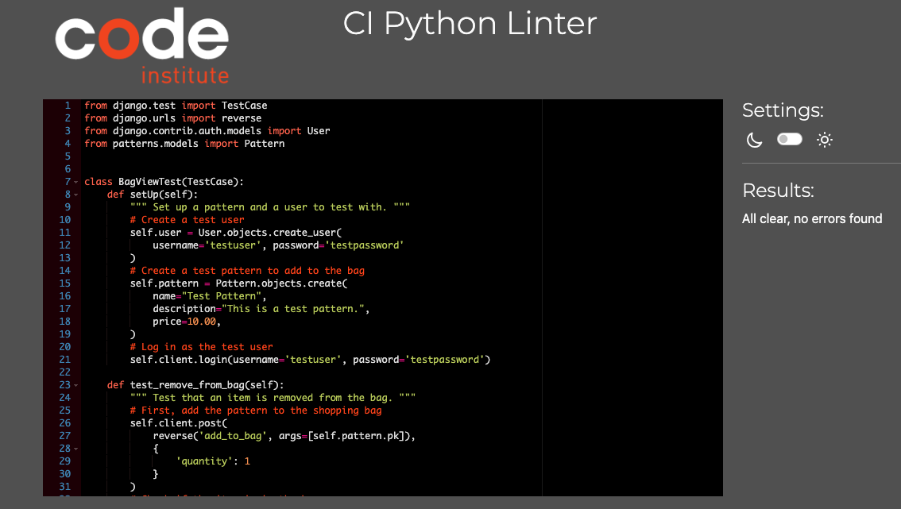
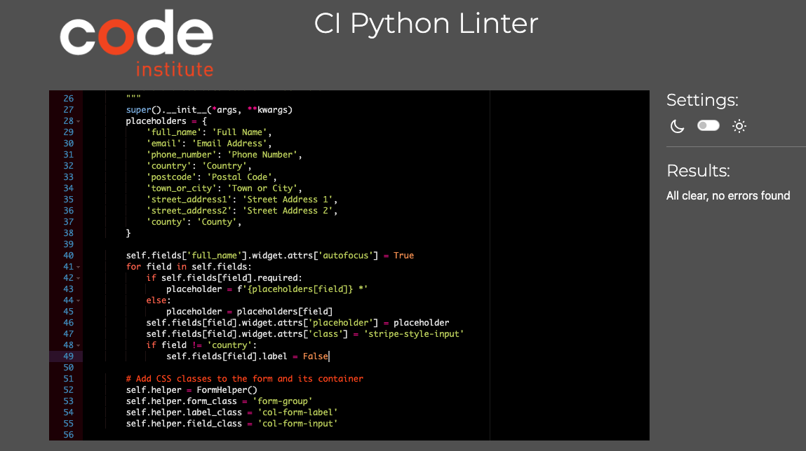
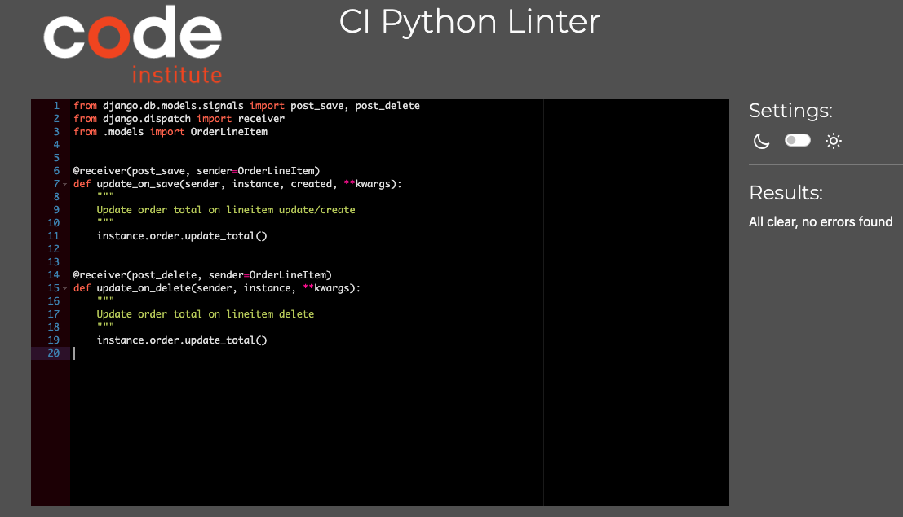
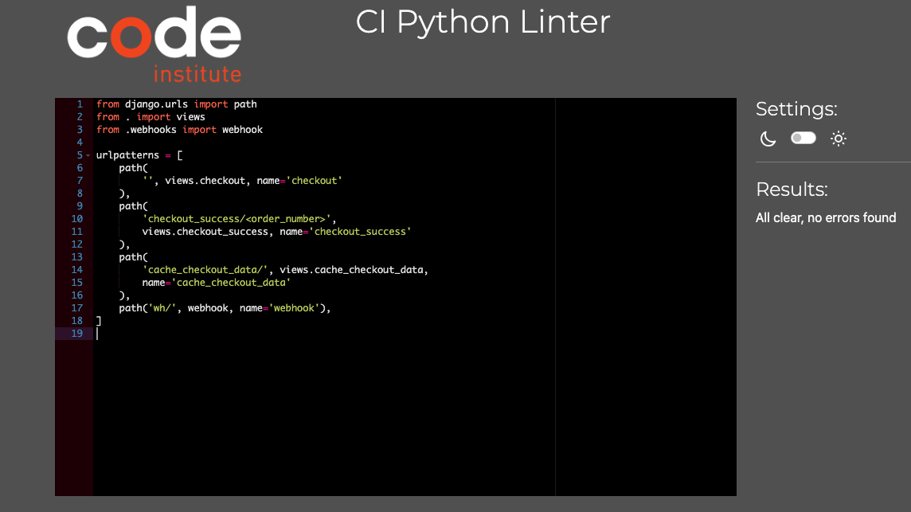
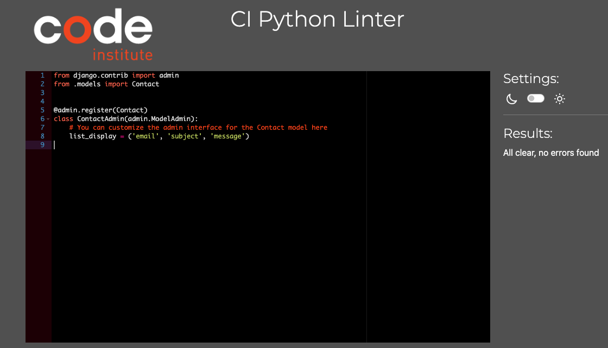
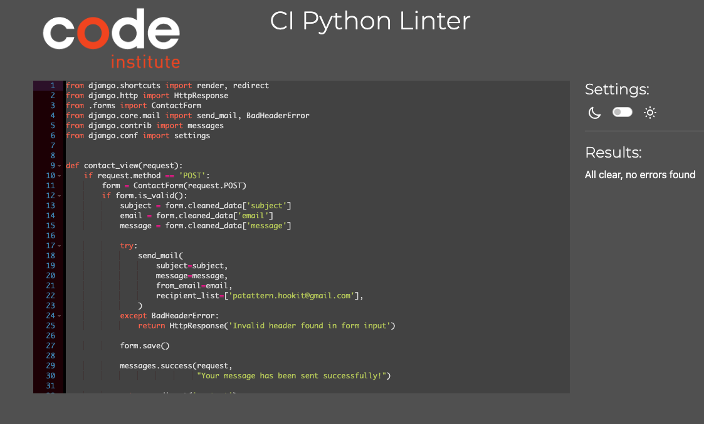
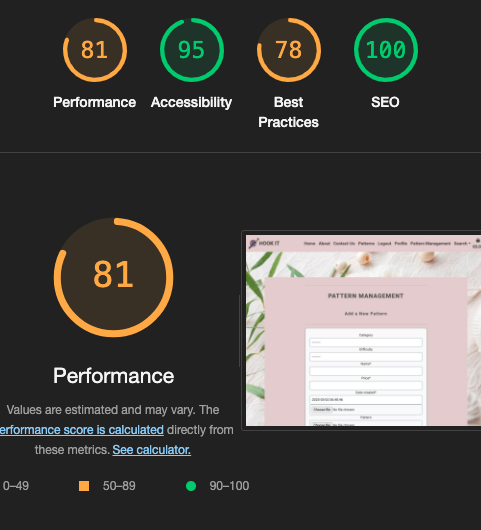
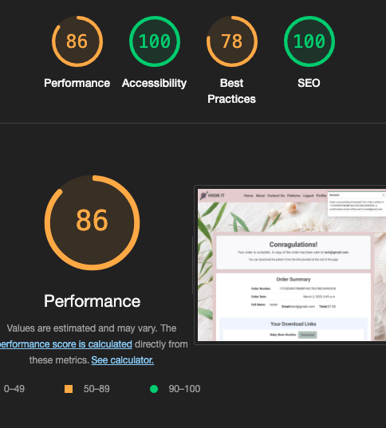
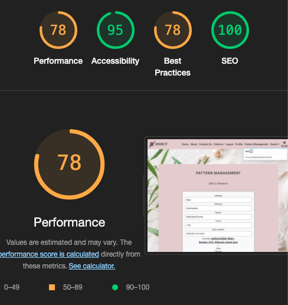
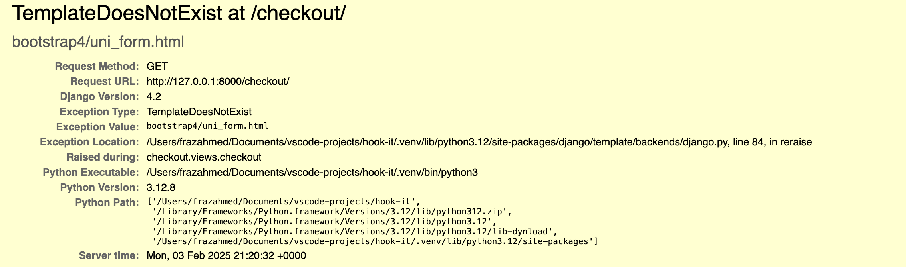

# Testing

Return back to the [README.md](README.md) file.

## Code Validation

### HTML

I have used the recommended [HTML W3C Validator](https://validator.w3.org) to validate all of my HTML files.

| Page | W3C URL | Screenshot | Notes |
| --- | --- | --- | --- |
| 404 | | Pass: No Errors |
| about |  | Pass: No Errors |
| add-pattern |   | Pass: No Errors |
| bag |  | Pass: No Errors |
| checkout |   | Pass: No Errors |
| checkout-success |   | Pass: No Errors |
| contact |   | Pass: No Errors |
| patterns |  | Pass: No Errors |
| edit-pattern |  | Pass: No Errors |
| delete-confirm |  | Pass: No Errors |
| home |   | Pass: No Errors |
| login |   | Pass: No Errors |
| pattern-detail |   | Pass: No Errors |
| profile | | Pass: No Errors |
| register |   | Pass: No Errors |
| sign-out |   | Pass: No Errors |

### CSS

I have used the recommended [CSS Jigsaw Validator](https://jigsaw.w3.org/css-validator) to validate all of my CSS files.

| File | Screenshot | Notes |
| --- | --- | --- |
| base.css |  | Pass: No Errors( input base.css code passed but there are errors from external css fields given below) |
| external css |  | Fail: external css files like bootstrap,chimpmonk mail causing errors|
| checkout.css |  | Pass: No Errors |
| profile.css |   | Pass: No Errors |

### JavaScript

I have used the recommended [JShint Validator](https://jshint.com) to validate all of my JS files.

| File | Screenshot | Notes |
| --- | --- | --- |
| stripe_elements.js |  | warning (use version 6)|
| countryfield.js |  | Pass: No Errors |
| quantity-input-script.js |  | warning (use version 6) |

### Python

I have used the recommended [PEP8 CI Python Linter](https://pep8ci.herokuapp.com) to validate all of my Python files.

### Bag App
| File |  Screenshot | Notes |
| --- | --- | --- |
| apps.py |  | Pass: No Errors |
| contexts.py |  | Pass: No Errors |
| urls.py | | Pass: No Errors |
| views.py |   |Pass: No Errors |
| tests.py |   | Pass: No Errors|
ur
### Checkout App
| File | CI URL | Screenshot | Notes |
| --- | --- | --- | --- |
| admin.py |  | Pass: No Errors |
| apps.py |  | Pass: No Errors |
| forms.py |  | Pass: NO Errors |
| models.py |  | Pass : No Errors|
| signals.py |  | Pass : No Errors|
| urls.py | |Pass : No Error |
| views.py | |Pass : No Errors|
| webhook_handler.py | | Pass : No Errors |
| webhooks.py |   |Pass : No Errors |
| tests.py |   |Pass : No Errors |

### Hook_It App
| File | CI URL | Screenshot | Notes |
| --- | --- | --- | --- |
| asgi.py |  | Pass: No Errors |
| settings.py |   |  Pass: No Errors  |
| urls.py |   |Pass : No Errors |
| views.py |   | Pass: No Errors |
| wsgi.py |  | Pass: No Errors |

### Contact App
| File | CI URL | Screenshot | Notes |
| --- | --- | --- | --- |
| admin.py |   |Pass : No Errors|
| apps.py |  | Pass: No Errors |
| models.py |  | Pass: No Errors |
| urls.py |   | Pass: No Errors |
| views.py |  |Pass : No Errors |
| tests.py |  |Pass : No Errors |

### Home App
| File |  Screenshot | Notes |
| --- |  --- | --- |
| apps.py | | Pass: No Errors |
| urls.py |   | Pass: No Errors |
| views.py |   |Pass : No Errors |
| tests.py | | Pass: No Errors |

### Patterns App
| File |  Screenshot | Notes |
| --- | --- | --- |
| admin.py |  |Pass : No Errors|
| apps.py |  | Pass: No Errors |
| forms.py |   |Pass : No Errors |
| models.py |   | Pass: No Errors |
| urls.py |   | Pass: No Errors |
| views.py |   |Pass : No errors|
| tests.py |   |Pass : No Errors|

### Profiles App
| File |  Screenshot | Notes |
| --- | --- | --- |
| admin.py |   | Pass: No Errors |
| apps.py |   | Pass : No Errors |
| forms.py |  | Pass : No Errors|
| models.py |   | Pass : No Errors |
| urls.py |   | Pass : No Errors|
| views.py |   | Pass : No Errors|
| tests.py |   |Pass : No Errors |

### Root Level Files
| File | Screenshot | Notes |
| --- | --- | --- |
| custom_storages.py |  | Pass: No Errors |
| manage.py |  | Pass: No Errors |

## Browser Compatibility

I've tested my deployed project on multiple browsers to check for compatibility issues.

| Browser | Screenshot | Notes |
| --- | --- | --- |
| Chrome |  | Works as expected |
| Safari |  | Works as expected |

## Responsiveness

I've tested my deployed project on multiple devices to check for responsiveness issues.

| Device | Screenshot | Notes |
| --- | --- | --- |
| Mobile (googl3-pixel-7) |  | Works as expected |
| Tablet (ipad-air) |  | Works as expected |
| Mac-book |  | Works as expected |
| XL Monitor |  | Works as expected |

## Lighthouse Audit

I've tested my deployed project using the Lighthouse Audit tool to check for any major issues.

On all pages, Lighthouse is flagging a warning 'Issues were logged in the Issues panel in Chrome Devtools'. This is caused by the built-in Stripe element used by the site.

| Page | Desktop | Notes |
| --- |  --- | --- |
| 404 |  |warnings in Diagnostics|
| about | | warnings in Diagnostics |
| add-patern |   | warnings in Diagnostics |
| bag |  |warnings in Diagnostics |
| checkout |  | warnings in Diagnostics |
| checkout-success |   | warnings in Diagnostics |
| contact |   | warnings in Diagnostics |
| patterns |  | warnings in Diagnostics|
| edit-pattern |   | warnings in Diagnostics |
| confirm-delete |   | warnings in Diagnostics |
| home |   |warnings in Diagnostics|
| sign-in |   | warnings in Diagnostics |
| pattern-detail |   | warnings in Diagnostics|
| profile |  |warnings in Diagnostics|
| sign-up |  |warnings in Diagnostics |
| sign-out |  | warnings in Diagnostics |

## Defensive Programming

Defensive programming was manually tested with the below user acceptance testing:

| Page | User Action | Expected Result | Pass/Fail 
| --- | --- | --- | --- | --- |
| Nav links | | | | |
| | Click on site name in navbar | Redirection to Home page | Pass |
| | Click on About Us link in navbar | Redirection to About page | Pass | |
| | Click on Patterns link in navbar | Redirection to Patterns page | Pass | |
| | Click on Contact link in navbar | Redirection to Contact page | Pass | |
| | Click on Search link in navbar | Search box dropdown, with input to search on Pattern page | Pass | |
| | Click on Register link in navbar | Redirection to Register page | Pass | |
| | Click on Login link in navbar | Redirection to Login page | Pass | |
| | Click on Bag link in navbar | Redirection to Bag page | Pass | |
| | Click on Profile link in navbar | Redirection to User Profile page | Pass | |
| | Click on Logout link in navbar | Redirection to Logout page | Pass | |
| | Click on Pattern Management link in navbar | Redirection to Add Pattern page | Pass | |
| | Click on Home link in navbar | Redirection to Home Page | Pass | |
| Footer | | | | |
| | Click on About Us link in footer | Redirection to About page | Pass | |
| | Click on Contact Us link in footer | Redirection to Contact page | Pass | |
| | Click on Privacy policy link in footer | Redirection to Privacy pocliy page | Pass | |
| | Click on 'Subscribe to our mailing list' button in footer | subscribtion essage | Pass | |
| Register | | | | |
| | Enter valid email address (twice) | Field will only accept email address format | Pass | |
| | Enter valid password (twice) | Field will only accept password format | Pass | |
| | Click on Sign Up button | Redirects user to blank Login page | Pass |
| | Click on Back To Login button | Redirects user to Login page | Pass |
| Log In | | | | |
| | Enter valid username/email | Field will accept username or email format | Pass | |
| | Enter valid password | Field will only accept password format | Pass | |
| | Click Login button | Log user in, Redirects to home page | Pass | |
| Log Out | | | | |
| | Click Logout button | Logs out user, Redirects user to home page | Pass |
| Profile | | | | |
| | Click on the Update Information button | Inputted information is saved | Pass | |
| | Click on Order History links | Redirects to user order confirmation/checkout success page | Pass | |
| Site Navigations - Logged Out User | | | | |
| | Navigate to any login required URL | Redirect to login page, redirect back after login | Pass | |
| Pattern | | | | |
| | Click on Patterrn title | Redirect to clicked pattern details page | Pass | |
| | Click on sorting dropdown options | Sort patterns by selected criteria | Pass | |
| Patterns - Admin Only| | | | |
| | Click on an edit button | Redirect to edit pattern page for that pattern | Pass | |
| | Click on a delete button | directs to confirm delete page | Pass | |
| Pattern Details | | | | |
| | Click on 'Keep Shopping' button | Redirect to pattern page | Pass | |
| | Click on 'Add To Bag' button | Adds pattern to bag, bag message displayed | Pass | |
| | Click on 'submit Review' button | posts Review, success message displayed | Pass | |
| Pattern Details - Admin Only | | | | |
| | Click on Edit button | Redirect to edit pattern page for that pattern | Pass | |
| |  Click on delete button | directs to confirm-delete page| Pass | |
| |  Click on edit button for reviews|Redirect to edit review page for that review | Pass | |
| |  Click on delete button | delete the review | Pass | |
| Contact | | | | |
| | Email input | Required, accepts only email format | Pass | |
| | Subject input | Required, user given a list of options | Pass | |
| | Message input | Required | Pass | |
| | Click on 'Submit' button |Success message | Pass | |
| Add New Pattern - Admin Only | | | | |
| | Category Input | Not required, select from options | Pass | |
| | Difficulty Input | Not required, select from options | Pass | |
| | Name Input | Required | Pass | |
| | Price Input | Required, Numbers only | Pass | |
| | Date-Created | auto fill | Pass | |
| | Image | required | Pass | |
| | pattern URL |  required | Pass | |
| | Description Input | Required | Pass | |
| | Click on 'Cancel' button | Redirect to Pattern page | Pass | |
| | Click on 'Update Pattern' button | Save changes, redirect to pattern details page | Pass | |
| Delete Pattern - Admin Only | | | | |
| | Delete button | deletes the pattern | Pass | |
| Bag | | | | |
| | Click on 'Remove' link | Remove item from bag | Pass | |
| | Click on 'Keep Shopping' button | Redirect to Patterns page | Pass | |
| | Click on 'Secure Checkout' button | Redirect to Checkout page | Pass | |
| Checkout | | | | |
| | Full Name Input | Required | Pass | |
| | Email Input | Required, autofill if saved | Pass | |
| | Phone Number Input | Required, autofill if saved | Pass | |
| | Street Address 1 Input | Required, autofill if saved | Pass | |
| | Street Address 2 Input | Not required, autofill if saved | Pass | |
| | Town Or City Input | Required, autofill if saved | Pass | |
| | County Input | Not required, autofill if saved | Pass | |
| | Postal Code Input | Not required, autofill if saved | Pass | |
| | Country Input | Required, autofill if saved, select from options | Pass | |
| | Stripe Card Details | Required, validates on input | Pass | |
| | Check 'save delivery info.' box | Saves information to user profile | Pass | |
| | Click on 'Adjust Bag' button | Redirect to Bag page | Pass | |
| | Click on 'Complete Order' button | Complete Checkout with given information, redirect to order confirmation page if valid | Pass | |
| Newsletter - Subscribe | | | | |
| | Email Input | Required | Pass | |
| | Click on 'Subscribe' button | Subscribes user| Pass | |

## Automated Testing Coverage Report:

### Test Coverage Report

| File | Statements | Missing | Coverage | Missing Lines |
|------|------------|---------|----------|---------------|
| `bag/__init__.py` | 0 | 0 | 100% | - |
| `bag/admin.py` | 1 | 0 | 100% | - |
| `bag/apps.py` | 4 | 0 | 100% | - |
| `bag/contexts.py` | 16 | 0 | 100% | - |
| `bag/migrations/__init__.py` | 0 | 0 | 100% | - |
| `bag/models.py` | 1 | 0 | 100% | - |
| `bag/templatetags/__init__.py` | 0 | 0 | 100% | - |
| `bag/templatetags/bag_tools.py` | 5 | 0 | 100% | - |
| `bag/tests.py` | 17 | 0 | 100% | - |
| `bag/urls.py` | 3 | 0 | 100% | - |
| `bag/views.py` | 41 | 15 | 63% | 24-25, 46-62, 75-77 |
| `checkout/__init__.py` | 1 | 0 | 100% | - |
| `checkout/admin.py` | 12 | 0 | 100% | - |
| `checkout/apps.py` | 6 | 0 | 100% | - |
| `checkout/forms.py` | 22 | 0 | 100% | - |
| `checkout/migrations/0001_initial.py` | 6 | 0 | 100% | - |
| `checkout/migrations/0002_order_original_bag_order_stripe_pid_order_total_and_more.py` | 5 | 0 | 100% | - |
| `checkout/migrations/0003_order_user_profile.py` | 5 | 0 | 100% | - |
| `checkout/migrations/__init__.py` | 0 | 0 | 100% | - |
| `checkout/models.py` | 47 | 4 | 91% | 38, 55, 59, 77 |
| `checkout/signals.py` | 9 | 1 | 89% | 19 |
| `checkout/tests.py` | 36 | 0 | 100% | - |
| `checkout/urls.py` | 4 | 0 | 100% | - |
| `checkout/views.py` | 97 | 65 | 33% | 19-31, 39-90, 95-96, 109-123, 128, 147-203 |
| `checkout/webhook_handler.py` | 74 | 58 | 22% | 18, 22-29, 40, 48-141, 149 |
| `checkout/webhooks.py` | 28 | 19 | 32% | 16-55 |
| `contact_us/__init__.py` | 0 | 0 | 100% | - |
| `contact_us/admin.py` | 5 | 0 | 100% | - |
| `contact_us/apps.py` | 4 | 0 | 100% | - |
| `contact_us/forms.py` | 6 | 0 | 100% | - |
| `contact_us/migrations/0001_initial.py` | 5 | 0 | 100% | - |
| `contact_us/migrations/__init__.py` | 0 | 0 | 100% | - |
| `contact_us/models.py` | 7 | 1 | 86% | 12 |
| `contact_us/tests.py` | 19 | 0 | 100% | - |
| `contact_us/urls.py` | 3 | 0 | 100% | - |
| `contact_us/views.py` | 23 | 2 | 91% | 24-25 |
| `custom_storages.py` | 6 | 6 | 0% | 1-10 |
| `home/__init__.py` | 0 | 0 | 100% | - |
| `home/admin.py` | 1 | 0 | 100% | - |
| `home/apps.py` | 4 | 0 | 100% | - |
| `home/migrations/__init__.py` | 0 | 0 | 100% | - |
| `home/models.py` | 1 | 0 | 100% | - |
| `home/tests.py` | 10 | 0 | 100% | - |
| `home/urls.py` | 3 | 0 | 100% | - |
| `home/views.py` | 8 | 1 | 88% | 20 |
| `hook_it/__init__.py` | 0 | 0 | 100% | - |
| `hook_it/asgi.py` | 4 | 4 | 0% | 10-16 |
| `hook_it/settings.py` | 70 | 21 | 70% | 152-153, 211-231, 251-257 |
| `hook_it/urls.py` | 7 | 0 | 100% | - |
| `hook_it/views.py` | 3 | 0 | 100% | - |
| `hook_it/wsgi.py` | 4 | 4 | 0% | 10-16 |
| `manage.py` | 11 | 2 | 82% | 12-13 |
| `patterns/__init__.py` | 0 | 0 | 100% | - |
| `patterns/admin.py` | 21 | 0 | 100% | - |
| `patterns/apps.py` | 4 | 0 | 100% | - |
| `patterns/forms.py` | 17 | 7 | 59% | 20-36 |
| `patterns/migrations/0001_initial.py` | 7 | 0 | 100% | - |
| `patterns/migrations/0002_alter_pattern_options_pattern_description.py` | 5 | 0 | 100% | - |
| `patterns/migrations/0003_review.py` | 7 | 0 | 100% | - |
| `patterns/migrations/__init__.py` | 0 | 0 | 100% | - |
| `patterns/models.py` | 31 | 3 | 90% | 11, 48, 75 |
| `patterns/tests.py` | 72 | 0 | 100% | - |
| `patterns/urls.py` | 3 | 0 | 100% | - |
| `patterns/views.py` | 135 | 79 | 41% | 14-67, 72-83, 88-114, 127-147, 174-180, 200-206, 233 |
| `patterns/widgets.py` | 7 | 0 | 100% | - |
| `profiles/__init__.py` | 0 | 0 | 100% | - |
| `profiles/admin.py` | 6 | 0 | 100% | - |
| `profiles/apps.py` | 3 | 0 | 100% | - |
| `profiles/forms.py` | 18 | 1 | 94% | 30 |
| `profiles/migrations/0001_initial.py` | 8 | 0 | 100% | - |
| `profiles/migrations/0002_userprofile_default_email.py` | 4 | 0 | 100% | - |
| `profiles/migrations/0003_userprofile_default_name.py` | 4 | 0 | 100% | - |
| `profiles/migrations/0004_rename_default_email_userprofile_default_user_email_and_more.py` | 4 | 0 | 100% | - |
| `profiles/migrations/__init__.py` | 0 | 0 | 100% | - |
| `profiles/models.py` | 22 | 1 | 95% | 26 |
| `profiles/tests.py` | 44 | 0 | 100% | - |
| `profiles/urls.py` | 3 | 0 | 100% | - |
| `profiles/views.py` | 36 | 2 | 94% | 22, 58 |
| **TOTAL** | **1105** | **296** | **73%** | - |

# bugs and fixes:

foreign key error in serch term

solution:

Since category is a foreign key, we can't filter it with icontains directly as if it were a CharField. we need to filter based on a field within the related Category model, like category__name__icontains.

## Error redirect error:

Redirect error for clicking add to bag button.

Solution:

Import Redirect from django shortcuts.

## Cispy_form error:

Crispy_form error :

Solution:

added 'crispy_bootstrap4' in installed apps to fix it.

## stripe card input field disabled:

Issue: On the checkout page, the payment card input field was disabled due to an insecure form connection.

Solution: I resolved this issue by clearing the browser history and cache, which allowed the form to reload securely.

## problem with media files:

Issue: I was unable to view media files, such as the logo, background, and other images, on my app.

Solution: After removing the SSL configuration from the settings, everything started working properly.

## Value Error:

Issue: Sorting was failing because one of the patterns had no image.

Solution: Added a default image URL to prevent errors when an image is missing.

## Unsolved Errors and Bugs:
 
 

